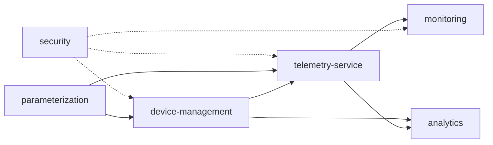

# SOMNGUARD

## Mapa de dominio

**Estado:** En progreso
**Fecha:** 2026-08-19

Mapa de dominio del sistema: módulos del backend (bounded contexts), su clasificación y relaciones. El backend es un monolito modular hexagonal, por lo que los "bounded contexts" se materializan como módulos (ver `09-modules/module-catalog.md` y ADR-002).

## Clasificación de dominios

| Clasificación | Módulo | Por qué |
|---------------|--------|---------|
| **CORE** | `telemetry-service` | Corazón del sistema: eventos, evidencia y alertas |
| **CORE** | `device-management` | Ciclo de vida del dispositivo, base de la captura |
| SUPPORTING | `security` | Autenticación y autorización de todos los flujos |
| SUPPORTING | `monitoring` | Notificaciones de eventos críticos |
| SUPPORTING | `analytics` | Consultas analíticas y reportes |
| GENERIC | `parameterization` | Catálogos configurables reutilizables |

## Context map

| Relación | Patrón | Nota |
|----------|--------|------|
| `device-management` → `telemetry-service` | U (upstream) | Los eventos llegan de dispositivos conocidos |
| `parameterization` → `telemetry-service` | CS (customer-supplier) | Catálogos validan eventos (categoría, severidad) |
| `security` → resto | ACL (anticorruption layer) | JWT y RBAC en la frontera |
| `telemetry-service` → `monitoring` | U | Eventos críticos disparan notificaciones |

## Lenguaje ubicuo

| Término | Significado |
|---------|-------------|
| Dispositivo | Raspberry Pi + cámara instalado en campo |
| Evento | Detección registrada (categoría, tipo, severidad) |
| Evidencia | Multimedia asociada a un evento |
| Alerta | Aviso local reproducido por el dispositivo |
| Notificación | Mensaje push/in-app hacia la cuenta propietaria |
| Cuenta | Usuario de plataforma (conductor o administrador) |
| Asignación | Relación dispositivo ↔ cuenta |

Ver el glosario completo en [glossary.md](./glossary.md).

## Ver también

- [Entidades y reglas de negocio](entities-and-rules.md)
- [Eventos de dominio](domain-events.md)
- [Análisis del software](../04-requeriments/software-analysis.md)