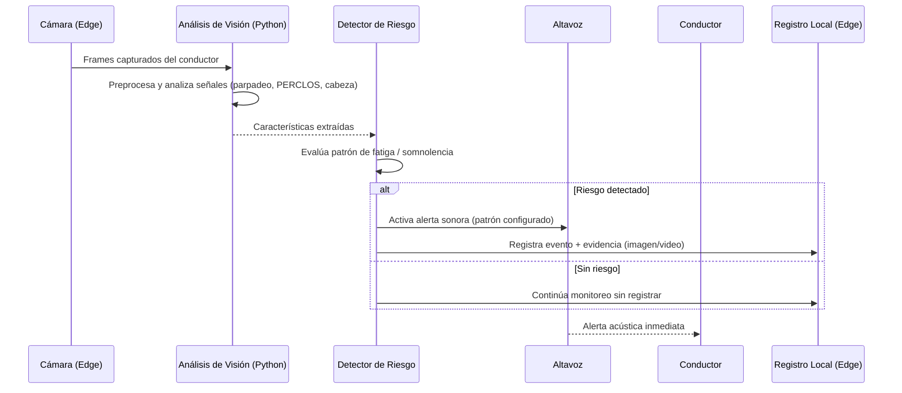
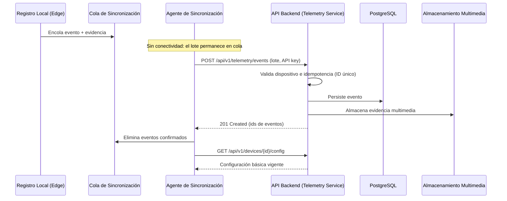
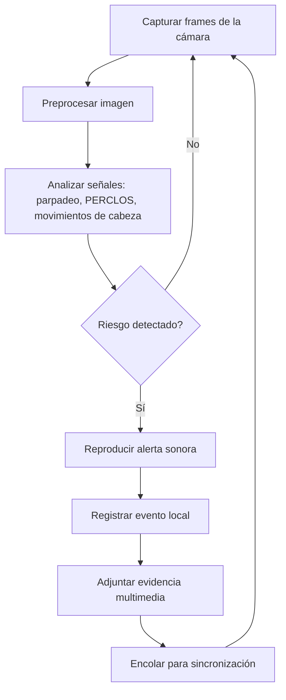
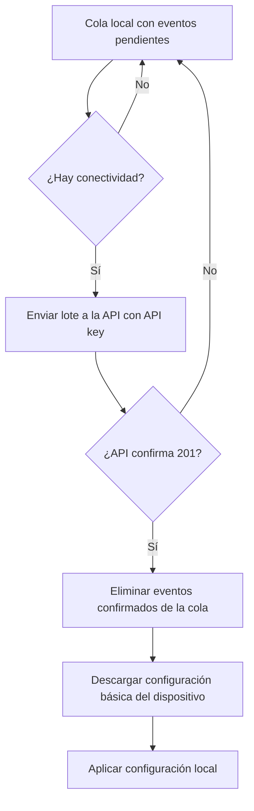
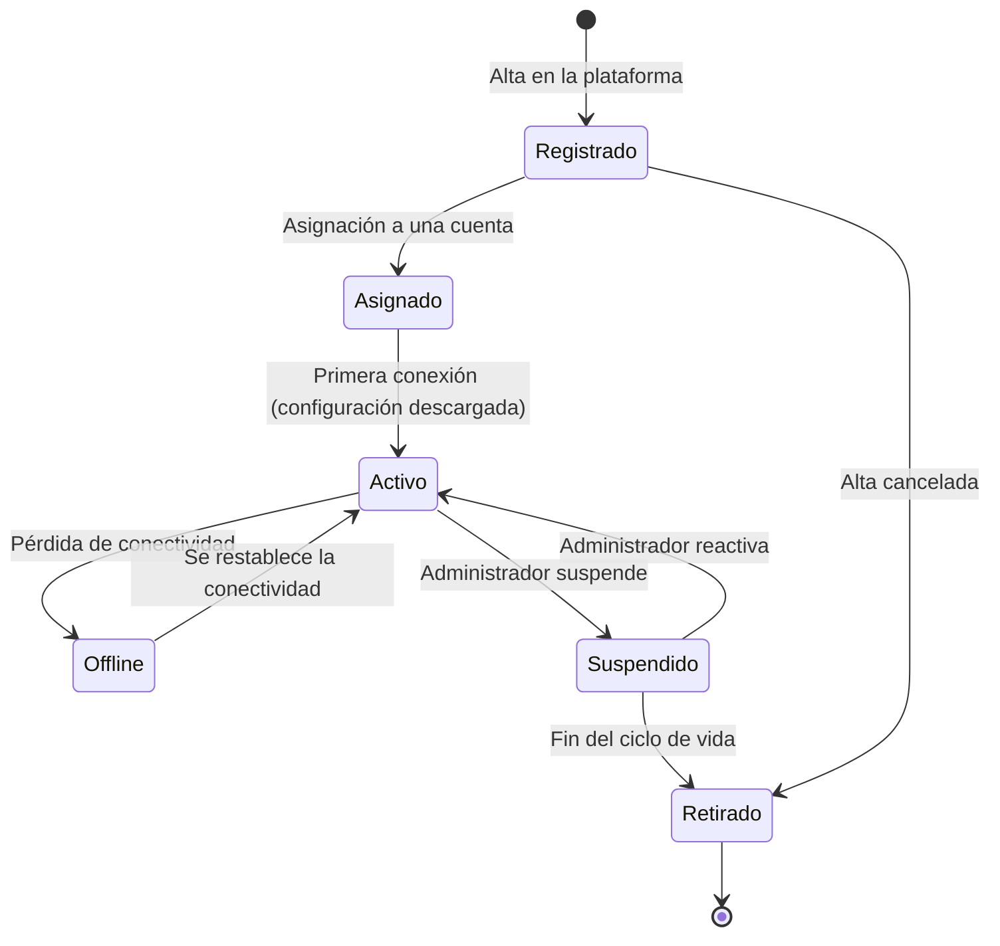
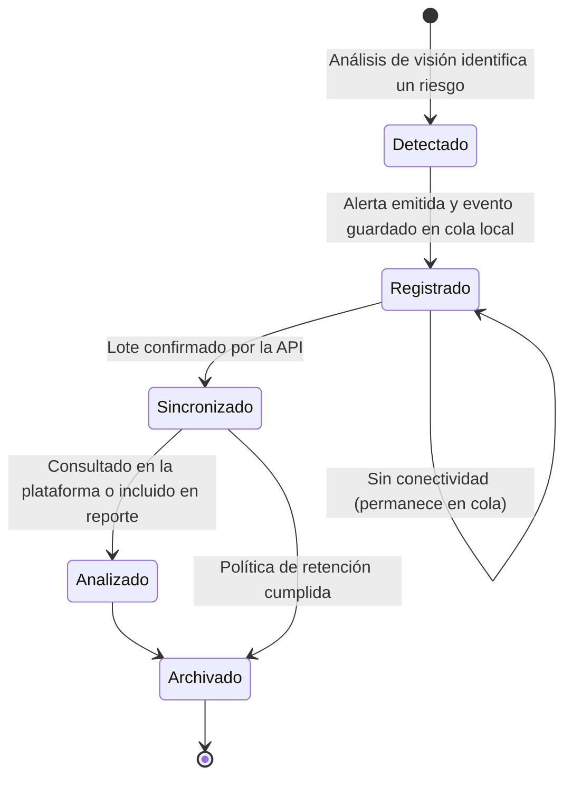
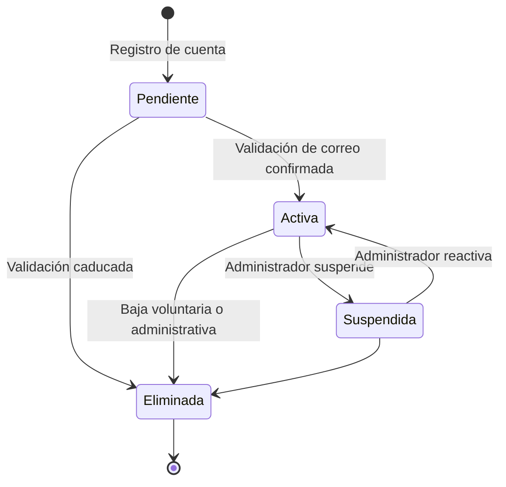

<div style="display:flex; align-items:center; justify-content:space-between;">

<div>

</div>

<div align="right">

# SOMNGUARD

## Documentación de Análisis del Software

**Estado:** En progreso
**Fecha:** 2026-08-19

</div>

</div>

---

## Contenido

- [1. Introducción](#1-introducción)
- [2. Descripción del sistema](#2-descripción-del-sistema)
- [3. Modelo de dominio](#3-modelo-de-dominio)
- [4. Casos de uso](#4-casos-de-uso)
- [5. Vistas estáticas](#5-vistas-estáticas)
- [6. Vistas dinámicas](#6-vistas-dinámicas)
- [7. Análisis de requisitos por módulo](#7-análisis-de-requisitos-por-módulo)
- [8. Trazabilidad](#8-trazabilidad)

---

## 1. Introducción

### 1.1 Propósito del documento

El propósito de este documento es presentar el análisis del software SomnGuard: el modelo de dominio, los casos de uso, las vistas estáticas y las **vistas dinámicas** del sistema (secuencia, actividades y estados), como puente entre la especificación de requisitos (SRS) y el diseño detallado (informe de diseño de software).

### 1.2 Alcance

El análisis cubre los componentes de software de SomnGuard: plataforma cloud (backend, portal web, app móvil), dispositivo edge y sus interacciones. No cubre el diseño de hardware.

### 1.3 Documentos de referencia

| Documento | Ubicación |
|-----------|-----------|
| SRS | [01-srs/](./01-srs/) |
| Funcionalidades del sistema | [system-functionalities.md](./system-functionalities.md) |
| Estructura módulo-entidad | [module-entity-structure.md](./module-entity-structure.md) |
| Modelo de datos vigente | [../06-data-architecture/02-modules-entities.md](../06-data-architecture/02-modules-entities.md) |
| Índice de diagramas | [../08-uml/diagram-index.md](../08-uml/diagram-index.md) |
| Informe de diseño de software | [../05-architecture/software-design-report.md](../05-architecture/software-design-report.md) |

---

## 2. Descripción del sistema

SomnGuard es un sistema de prevención de accidentes por fatiga o somnolencia al volante, compuesto por:

- **Dispositivo edge**: cámara y procesador embebido (Raspberry Pi) que monitorea al conductor, detecta estados de riesgo mediante visión por computadora (Python) y emite alertas sonoras inmediatas.
- **Plataforma cloud**: backend monolito modular (Java 21 + Spring Boot 3.x), base de datos PostgreSQL, portal web (React JS) y app móvil (React Native), que almacenan los eventos sincronizados, permiten su consulta/análisis y gestionan cuentas, dispositivos y catálogos.

Funcionalidades principales (detalle en [system-functionalities.md](./system-functionalities.md)):

| # | Funcionalidad |
|---|---------------|
| F-01 | Monitoreo continuo del conductor |
| F-02 | Detección de estados de riesgo (somnolencia/fatiga) |
| F-03 | Generación de alertas sonoras |
| F-04 | Registro de eventos con evidencia |
| F-05 | Transmisión de información a la plataforma (con soporte offline) |
| F-06 | Análisis de datos y generación de reportes |
| F-07 | Gestión de dispositivos (alta, asignación, configuración) |
| F-08 | Notificaciones de eventos críticos |
| F-09 | Gestión de cuentas, roles y permisos |
| F-10 | Administración de catálogos (parameterization) |

---

## 3. Modelo de dominio

El modelo de dominio agrupa **20 entidades** en 6 módulos, alineado con el modelo de datos vigente:

| Módulo | Entidades |
|--------|-----------|
| Security | user, role, module, feature, role_feature, user_role, password_reset_request, audit_login |
| Parameterization | event_category, severity, media_type, sound_pattern, event_type |
| Device Management | device, device_assignment, device_config |
| Telemetry Service | event, evidence, alert_log |
| Monitoring | notification |
| Analytics | vistas/reportes derivados (sin entidades transaccionales) |

Diagrama de clases del dominio: [cd-domain.mmd](../08-uml/diagrams/source/cd-domain.mmd) ([exportación](../08-uml/diagrams/exports/cd-domain.png)).

---

## 4. Casos de uso

Los casos de uso están modelados en [08-uml](../08-uml/diagram-index.md):

| Diagrama | Descripción |
|----------|-------------|
| `cu-general` | Actores y relación dispositivo ↔ plataforma |
| `cu-device` | Ciclo de vida del dispositivo, captura, alertas y sincronización |
| `cu-local-management` | Operaciones locales del dispositivo |
| `cu-account-device` | Registro, validación, login y asociación de dispositivos |
| `cu-plataforma` | Funcionalidades de la plataforma |
| `cu-analytics-visualization` | Módulo analítico: línea de tiempo, evidencia, métricas, resumen IA y reportes |

---

## 5. Vistas estáticas

### 5.1 Estructura de módulos (backend)

```
com.somnguard
├── security
├── parameterization
├── device-management
├── telemetry-service
├── monitoring
├── analytics
└── platform        # Transversal, fuera de los módulos: errores, logging, observabilidad
```

Cada módulo se organiza con arquitectura hexagonal (puertos y adaptadores): `application/port/{in,out}`, `application/usecase`, `domain/{model,service}`, `adapter/in/{web,amqp}`, `adapter/out/{persistence,storage}` (ver [documento de arquitectura](../05-architecture/architecture-document.md) y ADR-002).

### 5.2 Componentes por entorno

| Entorno | Componente | Tecnología |
|---------|------------|------------|
| Edge | Captura, análisis de visión, alertas, agente de sincronización | Raspberry Pi, Python |
| Cloud | API REST, base de datos, almacenamiento multimedia, notificaciones | Java 21, Spring Boot 3.x, PostgreSQL, Liquibase |
| Clientes | Portal web, app móvil | React JS, React Native |

---

## 6. Vistas dinámicas

Las vistas dinámicas describen el comportamiento del sistema: qué flujos ejecuta, en qué orden y cómo cambia el estado de sus entidades.

### 6.1 Diagramas de secuencia

Fuentes y exportaciones en `../08-uml/diagrams/source/` y `../08-uml/diagrams/exports/`:

| Flujo | Fuente | Exportación |
|-------|--------|-------------|
| Detección y alerta (edge) | [sd-detection-alert.mmd](../08-uml/diagrams/source/sd-detection-alert.mmd) | [sd-detection-alert.png](../08-uml/diagrams/exports/sd-detection-alert.png) |
| Sincronización offline | [sd-offline-sync.mmd](../08-uml/diagrams/source/sd-offline-sync.mmd) | [sd-offline-sync.png](../08-uml/diagrams/exports/sd-offline-sync.png) |
| Autenticación | [sd-authentication.mmd](../08-uml/diagrams/source/sd-authentication.mmd) | [sd-authentication.png](../08-uml/diagrams/exports/sd-authentication.png) |
| Restablecimiento de contraseña | [sd-password-reset.mmd](../08-uml/diagrams/source/sd-password-reset.mmd) | [sd-password-reset.png](../08-uml/diagrams/exports/sd-password-reset.png) |
| Alta y asignación de dispositivo | [sd-device-registration.mmd](../08-uml/diagrams/source/sd-device-registration.mmd) | [sd-device-registration.png](../08-uml/diagrams/exports/sd-device-registration.png) |
| Consulta de eventos | [sd-events-query.mmd](../08-uml/diagrams/source/sd-events-query.mmd) | [sd-events-query.png](../08-uml/diagrams/exports/sd-events-query.png) |
| Notificación de evento crítico | [sd-critical-notification.mmd](../08-uml/diagrams/source/sd-critical-notification.mmd) | [sd-critical-notification.png](../08-uml/diagrams/exports/sd-critical-notification.png) |
| Generación de reporte | [sd-report-generation.mmd](../08-uml/diagrams/source/sd-report-generation.mmd) | [sd-report-generation.png](../08-uml/diagrams/exports/sd-report-generation.png) |

#### Secuencia: detección y alerta



#### Secuencia: sincronización offline



### 6.2 Diagramas de actividades

| Flujo | Fuente | Exportación |
|-------|--------|-------------|
| Detección de evento | [ac-event-detection.mmd](../08-uml/diagrams/source/ac-event-detection.mmd) | [ac-event-detection.png](../08-uml/diagrams/exports/ac-event-detection.png) |
| Sincronización offline | [ac-offline-sync.mmd](../08-uml/diagrams/source/ac-offline-sync.mmd) | [ac-offline-sync.png](../08-uml/diagrams/exports/ac-offline-sync.png) |
| Generación de reporte | [ac-report-generation.mmd](../08-uml/diagrams/source/ac-report-generation.mmd) | [ac-report-generation.png](../08-uml/diagrams/exports/ac-report-generation.png) |
| Registro de cuenta | [ac-account-registration.mmd](../08-uml/diagrams/source/ac-account-registration.mmd) | [ac-account-registration.png](../08-uml/diagrams/exports/ac-account-registration.png) |

#### Actividad: detección de evento



#### Actividad: sincronización offline



### 6.3 Diagramas de estados

| Entidad | Fuente | Exportación |
|---------|--------|-------------|
| Dispositivo | [es-device.mmd](../08-uml/diagrams/source/es-device.mmd) | [es-device.png](../08-uml/diagrams/exports/es-device.png) |
| Evento | [es-event.mmd](../08-uml/diagrams/source/es-event.mmd) | [es-event.png](../08-uml/diagrams/exports/es-event.png) |
| Cuenta | [es-account.mmd](../08-uml/diagrams/source/es-account.mmd) | [es-account.png](../08-uml/diagrams/exports/es-account.png) |

#### Estados del dispositivo



#### Estados del evento



#### Estados de la cuenta



---

## 7. Análisis de requisitos por módulo

| Módulo | Funcionalidades relacionadas | Casos de uso | Diseño (informe) |
|--------|------------------------------|--------------|------------------|
| Security | F-09 | cu-account-device | Autenticación JWT, roles y permisos |
| Parameterization | F-10 | cu-plataforma | Catálogos configurables |
| Device Management | F-07 | cu-device, cu-plataforma | Alta, asignación y configuración |
| Telemetry Service | F-01, F-02, F-03, F-04, F-05 | cu-device, cu-local-management | Eventos, evidencia, alertas, sincronización |
| Monitoring | F-08 | cu-plataforma | Notificaciones de eventos críticos |
| Analítico | F-06 | cu-analytics-visualization | Línea de tiempo, métricas, resumen IA, reportes |

---

## 8. Trazabilidad

| Funcionalidad | Caso de uso | Vistas dinámicas | Módulo backend | Pruebas (estrategia) |
|---------------|-------------|------------------|----------------|----------------------|
| F-01 Monitoreo continuo | cu-device | sd-detection-alert, ac-event-detection | Telemetry Service + Edge | Unitarias del detector; integración del agente |
| F-02 Detección de riesgo | cu-device | sd-detection-alert, es-event | Edge + Telemetry Service | Validación con datos de campo |
| F-03 Alertas sonoras | cu-device | sd-detection-alert | Edge | Pruebas en prototipo |
| F-04 Registro de eventos | cu-local-management | sd-offline-sync, es-event | Telemetry Service | Unitarias de repositorio; integración |
| F-05 Transmisión a plataforma | cu-general | sd-offline-sync, ac-offline-sync | Telemetry Service | Integración con API simulada |
| F-06 Análisis y reportes | cu-analytics-visualization | sd-report-generation, ac-report-generation | Analítico | Pruebas de API y E2E del portal |
| F-07 Gestión de dispositivos | cu-device, cu-plataforma | sd-device-registration, es-device | Device Management | Unitarias e integración |
| F-08 Notificaciones | cu-plataforma | sd-critical-notification | Monitoring | Pruebas de integración del push |
| F-09 Cuentas y roles | cu-account-device | sd-authentication, sd-password-reset, es-account | Security | Unitarias de seguridad; integración |
| F-10 Catálogos | cu-plataforma | — | Parameterization | CRUD por API |

---

*Documento de análisis alineado con el SRS, el modelo de datos vigente (20 entidades) y los diagramas UML publicados en `08-uml`.*