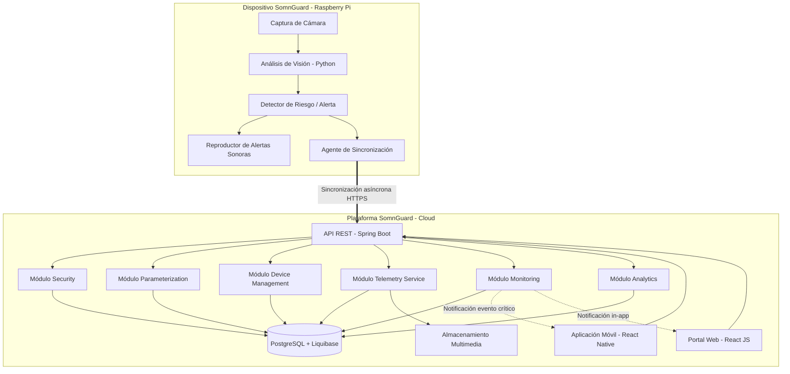
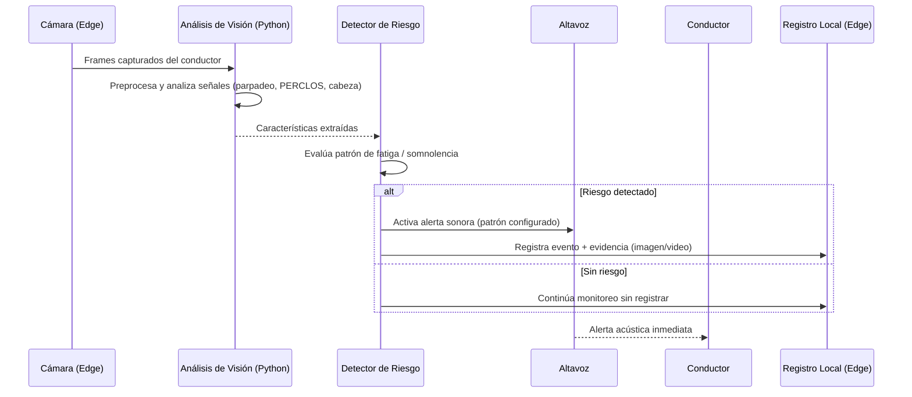
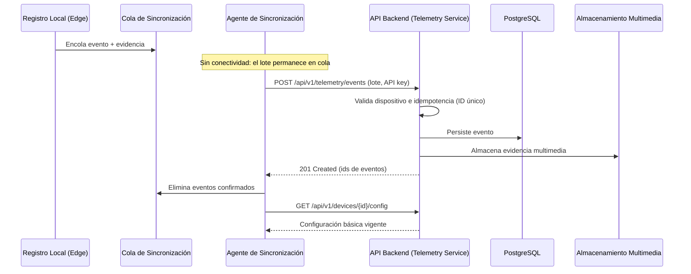
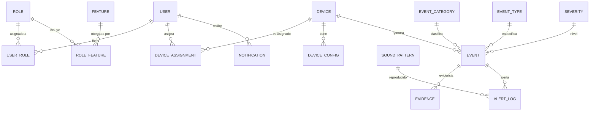

<div style="display:flex; align-items:center; justify-content:space-between;">

<div>

</div>

<div align="right">

# SOMNGUARD

## Informe de Diseño de Software

**Estado:** En progreso
**Fecha:** 2026-08-19

</div>

</div>

---

## Contenido

- [1. Introducción](#1-introducción)
- [2. Descripción general del sistema](#2-descripción-general-del-sistema)
- [3. Modelo arquitectónico](#3-modelo-arquitectónico)
- [4. Diseño de componentes o módulos](#4-diseño-de-componentes-o-módulos)
- [5. Diagramas UML](#5-diagramas-uml)
- [6. Diseño de base de datos](#6-diseño-de-base-de-datos)
- [7. Diseño de interfaces](#7-diseño-de-interfaces)
- [8. Patrones de diseño](#8-patrones-de-diseño)
- [9. Reglas de negocio](#9-reglas-de-negocio)
- [10. Seguridad del sistema](#10-seguridad-del-sistema)
- [11. Especificaciones técnicas](#11-especificaciones-técnicas)
- [12. Consideraciones de implementación](#12-consideraciones-de-implementación)

---

## 1. Introducción

### 1.1 Propósito del documento

El propósito de este documento es describir el diseño del sistema SomnGuard: su modelo arquitectónico, la organización en componentes y módulos, el modelo de datos, los diagramas UML, el diseño de interfaces gráficas, los patrones de diseño aplicados, las reglas de negocio y los aspectos de seguridad y técnicos necesarios para su desarrollo e implementación.

Este documento proporciona una visión detallada de cómo estará organizado el sistema y establece una referencia técnica para el equipo de desarrollo, sirviendo como guía para las etapas de implementación, pruebas y mantenimiento del proyecto.

### 1.2 Alcance del sistema

El producto especificado en este documento es SomnGuard, un sistema orientado a la prevención de accidentes de tránsito causados por fatiga, somnolencia o microsueños en conductores, así como a la recolección de evidencia relevante en caso de que ocurra un evento crítico.

SomnGuard monitorea el estado de alerta del conductor mediante el análisis de señales visuales capturadas por una cámara embarcada (edge), con el fin de identificar patrones asociados a fatiga o somnolencia. Cuando el sistema detecta un posible estado de riesgo, genera alertas sonoras para advertir al conductor y contribuir a la prevención de accidentes.

Adicionalmente, el sistema registra información relevante antes, durante y después de eventos críticos, con el fin de proporcionar evidencia (fotografías y/o video) que permita analizar posibles causas relacionadas con el estado del conductor. Esta información se transmite a la plataforma cloud, donde puede ser consultada para fines de revisión, control o soporte en investigaciones.

Quedan fuera del alcance de esta versión la toma de decisiones automáticas sobre el control del vehículo, la comunicación con terceros (aseguradoras o autoridades) y cualquier tipo de responsabilidad legal derivada de accidentes. Este documento se limita al diseño del software; no incluye el diseño detallado del hardware ni de la infraestructura física.

### 1.3 Definiciones y términos

| Término | Definición |
|---------|------------|
| Edge | Procesamiento local en el dispositivo SomnGuard (Raspberry Pi). |
| Dispositivo SomnGuard | Unidad instalada en el vehículo: cámara, procesador embebido, altavoz y módulo de conectividad. |
| Plataforma SomnGuard | Aplicación cloud compuesta por backend (API), portal web y aplicación móvil. |
| Evento | Detección de un estado de riesgo (somnolencia, distracción, etc.) registrada por el dispositivo. |
| Alerta | Aviso sonoro y/o visual emitido para advertir al conductor en el momento de la detección. |
| Evidencia | Recurso multimedia (imagen o video) capturado alrededor de un evento crítico. |
| Microsueño | Episodio involuntario de pérdida de atención de corta duración. |
| Monolito modular | Aplicación única desplegada como un solo artefacto, organizada internamente en módulos independientes. |

### 1.4 Referencias de documentos relacionados

| Documento | Ubicación |
|-----------|-----------|
| Documento de arquitectura | [architecture-document.md](./architecture-document.md) |
| ADR-001 (backend Java / Spring Boot) | [decisions/records/ADR-001-backend-java-spring-boot.md](./decisions/records/ADR-001-backend-java-spring-boot.md) |
| Casos de uso (diagramas) | [../08-uml/diagram-index.md](../08-uml/diagram-index.md) |
| Modelo entidad-relación | [../06-data-architecture/01-entity-relationship-model.mmd](../06-data-architecture/01-entity-relationship-model.mmd) |
| Módulos y entidades | [../06-data-architecture/02-modules-entities.md](../06-data-architecture/02-modules-entities.md) |
| Diccionario de datos | [../06-data-architecture/03-data-dictionary.md](../06-data-architecture/03-data-dictionary.md) |
| Diseño de la API | [../07-api-design/api-design.md](../07-api-design/api-design.md) |

---

## 2. Descripción general del sistema

### 2.1 Objetivo del sistema

El objetivo del sistema SomnGuard es monitorear en tiempo real el estado del conductor con el fin de detectar posibles signos de fatiga o somnolencia durante la conducción y emitir alertas sonoras que ayuden a prevenir accidentes.

El sistema procesa las señales capturadas por la cámara mediante algoritmos de análisis visual (en el borde), determina posibles estados de somnolencia y, cuando se detecta una condición de riesgo, genera una alerta sonora para llamar la atención del conductor. Todo evento relevante se registra y sincroniza con la plataforma para su análisis posterior.

### 2.2 Usuarios del sistema

- **Conductor**: usuario principal. Persona que conduce el vehículo equipado con SomnGuard y recibe las alertas sonoras cuando se detectan posibles signos de somnolencia.
- **Usuario de la plataforma**: persona propietaria del dispositivo que accede al portal web o a la aplicación móvil para consultar la información generada por SomnGuard (eventos, evidencia, métricas y reportes) y gestionar sus dispositivos.
- **Administrador técnico**: usuario con privilegios de gestión sobre el sistema, responsable de configuraciones, administración de catálogos, supervisión del funcionamiento y gestión de cuentas.

### 2.3 Funcionalidades principales

| Funcionalidad | Descripción |
|---------------|-------------|
| Monitoreo continuo del conductor | Supervisa el comportamiento del conductor mediante la cámara y algoritmos de visión para identificar patrones asociados a fatiga o somnolencia. |
| Detección de estados de riesgo | Analiza señales como parpadeo, cierre prolongado de ojos y movimientos de la cabeza para identificar posibles estados de somnolencia. |
| Generación de alertas sonoras | Emite advertencias auditivas cuando se detectan condiciones de riesgo, con el objetivo de recuperar la atención del conductor. |
| Registro de eventos | Almacena eventos y evidencia detectados durante la conducción para su posterior análisis. |
| Transmisión de información a la plataforma | Envía los registros generados por el dispositivo a la plataforma cloud cuando hay conectividad; soporta sincronización diferida (offline). |
| Análisis de datos y generación de reportes | Permite consultar la línea de tiempo de eventos, reproducir evidencia, ver métricas de comportamiento, generar resúmenes descriptivos con IA y descargar reportes. |
| Gestión de dispositivos | Asociación y administración del ciclo de vida del dispositivo (alta, vinculación a cuenta, configuración básica). |
| Notificaciones | Notificación in-app de eventos críticos en la plataforma. |

### 2.4 Contexto del sistema

El sistema opera en dos entornos complementarios:

- **A bordo (edge)**: el dispositivo SomnGuard instalado en el vehículo integra la cámara y procesa localmente las señales del conductor. Emite alertas sonoras en tiempo real y acumula los eventos cuando no hay conectividad.
- **En la nube (cloud)**: la plataforma SomnGuard (backend + portal web + app móvil) almacena los eventos y la evidencia sincronizados, permite su consulta y análisis, y administra cuentas, dispositivos y catálogos.

```
┌──────────────────────────────┐        ┌──────────────────────────────────────┐
│   ENTORNO DEL VEHÍCULO       │        │            ENTORNO CLOUD              │
│                              │        │                                      │
│  ┌───────────────┐  alerta   │        │  ┌────────────┐   ┌───────────────┐  │
│  │  Conductor    │◄───────── │        │  │  Backend   │   │  Portal Web   │  │
│  └───────────────┘           │        │  │ (Java API) │◄──│  React JS     │  │
│                              │        │  └─────┬──────┘   └───────────────┘  │
│  ┌───────────────────────┐   │  HTTPS  │        │            ┌────────────┐  │
│  │ Dispositivo SomnGuard │═══╪═════════╪════════╪════════════│  App Móvil │  │
│  │  Cámara + Raspberry Pi│   │ (API/REST│        │            │React Native│  │
│  │  + Análisis en Python │   │  + media)│        │            └────────────┘  │
│  └───────────────────────┘   │        ┌┴─────────┴┐                          │
│                              │        │ PostgreSQL │                         │
│                              │        └───────────┘                          │
└──────────────────────────────┘        └──────────────────────────────────────┘
```

---

## 3. Modelo arquitectónico

### 3.1 Estilo arquitectónico

SomnGuard combina dos estilos complementarios (ver ADR-001):

1. **Arquitectura híbrida edge-cloud**: el dispositivo a bordo es responsable del procesamiento en tiempo real (detección y alertas inmediatas), mientras que la plataforma cloud es responsable del almacenamiento, análisis, administración y notificaciones. El edge funciona de forma autónoma y sincroniza de forma asíncrona.
2. **Monolito modular en el backend**: la plataforma cloud se desarrolla como una única aplicación Java/Spring Boot desplegada como un solo artefacto, organizada internamente en módulos independientes con sus propias entidades y casos de uso. Se descarta la arquitectura de microservicios por su complejidad operativa innecesaria para un sistema de tamaño medio.

### 3.2 Arquitectura en capas (backend)

El backend sigue una **arquitectura limpia en capas**, donde cada capa tiene una responsabilidad específica y las dependencias apuntan hacia el dominio:

| Capa | Responsabilidad | Ejemplos |
|------|-----------------|----------|
| **Interfaces (API)** | Recibe peticiones HTTP/REST, valida entrada, expone DTOs y respuestas. | Controladores REST, validación de solicitudes, versionado. |
| **Application** | Orquesta los casos de uso: procesa solicitudes, aplica reglas de negocio y coordina los repositorios. | Servicios de aplicación, comandos/consultas, DTOs de entrada/salida. |
| **Domain** | Núcleo del sistema: entidades de dominio, reglas del negocio e interfaces (contratos) independientes de tecnología. | Entidades (Usuario, Dispositivo, Evento, Alerta), interfaces de repositorio, servicios de dominio. |
| **Infrastructure** | Implementa el acceso a datos y la integración con tecnologías externas. | Repositorios (Spring Data JPA), migraciones (Liquibase), cliente de almacenamiento multimedia, envío de notificaciones push. |

Regla de dependencia: **las capas externas pueden depender de las internas, nunca al revés**; el dominio no conoce Spring, HTTP, JPA ni la base de datos. El mapeo de estas capas a la estructura hexagonal de paquetes está en la sección 3.2.1.

### 3.2.1 Arquitectura hexagonal (puertos y adaptadores)

La arquitectura limpia se formaliza como **hexagonal (puertos y adaptadores)**, siguiendo [ADR-002](./decisions/records/ADR-002-hexagonal-architecture.md). Cada módulo del monolito es un hexágono aislado:

| Elemento | Paquete | Rol |
|----------|---------|-----|
| Puertos de entrada | `application/port/in` | Interfaces de casos de uso: lo que el módulo puede hacer (ej: `IngestEventUseCase`, `GetEventQuery`). |
| Puertos de salida | `application/port/out` | Interfaces que el dominio necesita del exterior (ej: `EventRepository`, `EvidenceStore`). |
| Casos de uso | `application/usecase` | Implementaciones de los casos de uso. |
| Dominio | `domain/model`, `domain/service` | Entidades de negocio y servicios de dominio (reglas). |
| Adaptadores de entrada | `adapter/in/web`, `adapter/in/amqp` | Controladores REST y consumidores de mensajes. |
| Adaptadores de salida | `adapter/out/persistence`, `adapter/out/storage` | Implementaciones concretas: JPA/PostgreSQL, MinIO/S3, notificadores. |
| Transversal (fuera del módulo) | `platform` | Manejo de errores, logging y observabilidad; paquete único al nivel de `com.somnguard`, compartido por todos los módulos. |

Estructura de paquetes de referencia (Java/Spring Boot):

```text
com.somnguard.telemetry-service/
├── application/
│   ├── port/
│   │   ├── in/            # IngestEventUseCase, GetEventQuery, ...
│   │   └── out/           # EventRepository, EvidenceStore, ...
│   └── usecase/           # IngestEventService, GetEventService, ...
├── domain/
│   ├── model/             # Event, Evidence, AlertLog, ...
│   └── service/           # Evaluación de severidad, validación de eventos, ...
└── adapter/
    ├── in/
    │   ├── web/           # EventController, ...
    │   └── amqp/          # Consumidores (si aplica)
    └── out/
        ├── persistence/   # JpaEventAdapter, ...
        └── storage/       # MinioEvidenceStore, ...
```

> `platform` **no va dentro de cada módulo**: es un paquete único al nivel de `com.somnguard` (junto a los módulos: security, parameterization, device-management, telemetry-service, monitoring, analytics), compartido por todos. Los módulos pueden depender de `platform`; `platform` no depende de ningún módulo.

Beneficios: testabilidad con mocks de puertos, cambio tecnológico aislado en los adaptadores, y fronteras claras entre módulos (un módulo solo usa los puertos de entrada de otro), lo que facilita extraer un módulo a microservicio si se requiere.

### 3.3 Vista de componentes



### 3.4 Flujo del sistema por capas

1. **Edge (detección)**: la cámara captura el comportamiento del conductor; el análisis de visión (Python) detecta patrones de fatiga o somnolencia (p. ej., cierre prolongado de ojos, bostezos, movimientos de cabeza).
2. **Edge (alerta)**: cuando el detector identifica un estado de riesgo, el dispositivo reproduce una alerta sonora inmediata y registra un evento local (con evidencia multimedia si aplica).
3. **Edge (sincronización)**: el agente de sincronización envía los eventos acumulados a la API cuando hay conectividad; soporta cola local ante pérdida de conexión.
4. **Backend (application/domain)**: la API recibe el evento, valida el dispositivo (autenticación por API key), aplica reglas de negocio y persiste los datos a través de los repositorios.
5. **Backend (monitoring)**: si el evento es crítico, se genera una notificación para la cuenta propietaria del dispositivo.
6. **Frontends**: el portal web y la app móvil consumen la API para consultar eventos, evidencia, métricas y reportes.

### 3.5 Comparación de estilos evaluados

| Criterio | Monolito modular (elegido) | Microservicios (descartado) | Monolito clásico sin capas (descartado) |
|----------|---------------------------|-----------------------------|------------------------------------------|
| Mantenimiento | Alto: separación por módulos | Medio: alta complejidad operativa | Bajo: código mezclado |
| Complejidad de infraestructura | Baja (un artefacto) | Alta (varios servicios, redes, orquestación) | Baja |
| Escalabilidad | Suficiente para el alcance | Máxima, pero innecesaria aquí | Limitada |
| Despliegue | Simple | Complejo | Simple |
| Apto para el proyecto | Sí | No (sobredimensionado) | No (difícil de mantener) |

---

## 4. Diseño de componentes o módulos

El backend (monolito modular) se organiza en **seis** módulos que replican la estructura del modelo de datos. Cada módulo sigue la estructura hexagonal del ADR-002 (application, domain, adapter); analytics no agrega entidades transaccionales.

| Módulo | Responsabilidad | Entidades principales |
|--------|-----------------|-----------------------|
| **Security** | Gestión de cuentas, roles, permisos y autenticación; auditoría de inicios de sesión. | user, role, module, feature, role_feature, user_role, password_reset_request, audit_login |
| **Parameterization** | Catálogos configurables por el administrador: tipos de evento, severidades, tipos de medio y patrones de sonido. | event_category, severity, media_type, sound_pattern, event_type |
| **Device Management** | Ciclo de vida del dispositivo: alta, asignación a cuenta, configuración básica. | device, device_assignment, device_config |
| **Telemetry Service** | Recepción y consulta de eventos, gestión de evidencia multimedia y registro de alertas. | event, evidence, alert_log |
| **Monitoring** | Notificaciones a la cuenta ante eventos críticos. | notification |
| **Analytics** | Línea de tiempo, métricas, resumen IA y reportes (ver ADR-003). | vistas/reportes derivados |

### 4.1 Componentes por entorno

| Entorno | Componente | Tecnología | Responsabilidad |
|---------|------------|------------|-----------------|
| Edge | Captura | Cámara + Raspberry Pi | Adquisición de imágenes del conductor. |
| Edge | Análisis | Python | Detección de patrones de fatiga/somnolencia por visión. |
| Edge | Alertas | Altavoz / Python | Reproducción de alertas sonoras configuradas. |
| Edge | Sincronización | Agente (Python/HTTP) | Cola local y envío asíncrono de eventos y evidencia. |
| Cloud | API | Java 21 / Spring Boot 3.x | Exposición REST, aplicación de reglas de negocio y persistencia. |
| Cloud | Base de datos | PostgreSQL + Liquibase | Almacenamiento relacional versionado. |
| Cloud | Multimedia | Almacenamiento de objetos | Persistencia de imágenes/videos de evidencia. |
| Cloud | Portal web | React JS | Gestión de cuentas, dispositivos, consulta de eventos y reportes. |
| Cloud | App móvil | React Native | Consulta móvil, notificaciones y administración de dispositivos. |

---

## 5. Diagramas UML

Los diagramas de casos de uso están publicados en [../08-uml/diagram-index.md](../08-uml/diagram-index.md) con fuente editable en `diagrams/source/`:

| Diagrama | Descripción |
|----------|-------------|
| `cu-general` | Actores generales y relación dispositivo ↔ plataforma. |
| `cu-device` | Ciclo de vida del dispositivo, captura, alertas y sincronización. |
| `cu-local-management` | Operaciones locales del dispositivo (configuración, pruebas). |
| `cu-cuenta` | Gestión de cuenta, autenticación y recuperación. |
| `cu-plataforma` | Gestión de dispositivos, eventos y notificaciones desde la plataforma. |
| `cu-analytics-visualization` | Módulo analítico: línea de tiempo, evidencia, métricas, resumen IA y reportes. |

### 5.1 Diagramas de secuencia

Los siguientes diagramas de secuencia cubren los flujos principales del sistema. Fuentes editables en `08-uml/diagrams/source/` y exportaciones en `08-uml/diagrams/exports/`:

| Flujo | Fuente | Exportación |
|-------|--------|-------------|
| Detección y alerta | [sd-detection-alert.mmd](../08-uml/diagrams/source/sd-detection-alert.mmd) | [sd-detection-alert.png](../08-uml/diagrams/exports/sd-detection-alert.png) |
| Sincronización offline | [sd-offline-sync.mmd](../08-uml/diagrams/source/sd-offline-sync.mmd) | [sd-offline-sync.png](../08-uml/diagrams/exports/sd-offline-sync.png) |
| Autenticación | [sd-authentication.mmd](../08-uml/diagrams/source/sd-authentication.mmd) | [sd-authentication.png](../08-uml/diagrams/exports/sd-authentication.png) |
| Restablecimiento de contraseña | [sd-password-reset.mmd](../08-uml/diagrams/source/sd-password-reset.mmd) | [sd-password-reset.png](../08-uml/diagrams/exports/sd-password-reset.png) |
| Alta y asignación de dispositivo | [sd-device-registration.mmd](../08-uml/diagrams/source/sd-device-registration.mmd) | [sd-device-registration.png](../08-uml/diagrams/exports/sd-device-registration.png) |
| Consulta de eventos | [sd-events-query.mmd](../08-uml/diagrams/source/sd-events-query.mmd) | [sd-events-query.png](../08-uml/diagrams/exports/sd-events-query.png) |
| Notificación de evento crítico | [sd-critical-notification.mmd](../08-uml/diagrams/source/sd-critical-notification.mmd) | [sd-critical-notification.png](../08-uml/diagrams/exports/sd-critical-notification.png) |
| Generación de reporte | [sd-report-generation.mmd](../08-uml/diagrams/source/sd-report-generation.mmd) | [sd-report-generation.png](../08-uml/diagrams/exports/sd-report-generation.png) |

#### 5.1.1 Detección y alerta



#### 5.1.2 Sincronización offline



### 5.2 Diagrama de clases (dominio)

Las entidades del dominio y sus relaciones principales se modelan en [cd-domain.mmd](../08-uml/diagrams/source/cd-domain.mmd) ([exportación](../08-uml/diagrams/exports/cd-domain.png)), alineado con el modelo de datos de la sección 6.

---

## 6. Diseño de base de datos

### 6.1 Modelo de datos

El modelo de datos vigente está compuesto por **20 entidades** agrupadas en 5 módulos. El modelo conceptual y relacional se publican en:

- [Modelo entidad-relación (Mermaid)](../06-data-architecture/01-entity-relationship-model.mmd)
- [Módulos y entidades](../06-data-architecture/02-modules-entities.md)
- [Diccionario de datos](../06-data-architecture/03-data-dictionary.md)

| Módulo | Entidades | Descripción |
|--------|-----------|-------------|
| Security (8) | user, role, module, feature, role_feature, user_role, password_reset_request, audit_login | Cuentas, roles y permisos; solicitudes de reseteo de contraseña; registro de intentos de autenticación. |
| Parameterization (5) | event_category, severity, media_type, sound_pattern, event_type | Catálogos: categorías de eventos, niveles de severidad, tipos de medio, patrones de sonido y tipos de evento. |
| Device Management (3) | device, device_assignment, device_config | Dispositivos, asignación a cuentas y configuración básica del dispositivo. |
| Telemetry Service (3) | event, evidence, alert_log | Eventos detectados, evidencia multimedia asociada y registro de alertas emitidas. |
| Monitoring (1) | notification | Notificaciones de eventos críticos dirigidas a la cuenta. |

### 6.2 Relaciones principales



### 6.3 Estrategia de persistencia

- **PostgreSQL** como motor de base de datos relacional.
- **Liquibase** como herramienta de migración versionada: los cambios de esquema se versionan en changesets y se aplican en orden en todos los entornos (dev → qa → main).
- El acceso a datos se implementa con repositorios de Spring Data JPA en la capa de infraestructura; las entidades de dominio no dependen de JPA.
- La evidencia multimedia (imagen/video) se almacena fuera de la base de datos (almacenamiento de objetos); en la tabla `evidence` solo se guardan los metadatos y la referencia al recurso.

---

## 7. Diseño de interfaces

### 7.1 Principios generales

- Diseño **responsive** (escritorio y móvil) en el portal web (React JS).
- Aplicación móvil (React Native) con navegación por pestañas.
- Jerarquía visual clara: alertas críticas con alto contraste y notificación destacada.
- Estados vacíos, de carga y de error explícitos en todas las pantallas.
- Textos en español, terminología consistente con el glosario del dominio.

### 7.2 Portal web (React JS) — pantallas propuestas

| Pantalla | Ruta sugerida | Elementos |
|----------|---------------|-----------|
| Inicio de sesión | `/login` | Formulario usuario/contraseña, enlace "¿Olvidaste tu contraseña?", validación de captcha opcional. |
| Registro de cuenta | `/register` | Datos de cuenta, aceptación de términos. |
| Restablecer contraseña | `/reset-password` | Solicitud por correo y confirmación con token. |
| Panel principal (Dashboard) | `/dashboard` | Resumen de dispositivos, eventos recientes, alertas críticas, métricas rápidas (eventos por severidad, últimos 7 días). |
| Dispositivos | `/devices` | Lista de dispositivos asignados, estado (online/offline), alta de nuevo dispositivo y configuración básica. |
| Línea de tiempo de eventos | `/events` | Filtros por dispositivo, rango de fechas, severidad y tipo; listado cronológico con miniaturas de evidencia. |
| Detalle de evento | `/events/:id` | Datos del evento, nivel de severidad, evidencia reproducible (imagen/video) y alertas asociadas. |
| Métricas y comportamiento | `/analytics` | Gráficos de frecuencia de eventos por franja horaria, tendencias por severidad y resumen descriptivo generado con IA. |
| Reportes | `/reports` | Generación y descarga del reporte consolidado (PDF). |
| Notificaciones | `/notifications` | Lista de notificaciones de eventos críticos, leídas/no leídas. |
| Administración | `/admin/*` | Gestión de usuarios, roles y permisos; administración de catálogos (categorías, severidades, tipos de medio, patrones de sonido, tipos de evento). |

### 7.3 Aplicación móvil (React Native) — pantallas propuestas

| Pantalla | Elementos |
|----------|-----------|
| Inicio de sesión | Autenticación de cuenta y recordatorio de credenciales. |
| Pestaña Dispositivos | Lista de dispositivos con estado y configuración básica (sonido de alerta, sensibilidad). |
| Pestaña Eventos | Línea de tiempo de eventos del dispositivo seleccionado y acceso al detalle. |
| Detalle de evento | Información del evento, severidad y evidencia multimedia. |
| Pestaña Notificaciones | Notificaciones in-app de eventos críticos; apoyo de push notifications. |
| Configuración | Preferencias de notificación, idioma y cierre de sesión. |

### 7.4 Interfaz del dispositivo (no gráfica)

El dispositivo a bordo no posee interfaz gráfica en esta versión; su interfaz es **acústica**:

- Alertas sonoras mediante patrones de sonido configurables (repositorio de `sound_pattern`).
- Indicador luminoso de estado de operación (opcional en iteraciones futuras).
- Botón físico de prueba de alerta (validación local en campo).

---

## 8. Patrones de diseño

| Patrón | Capa / Componente | Aplicación |
|--------|-------------------|------------|
| **Repository** | adapter/out/persistence | Abstrae el acceso a datos mediante interfaces definidas en el dominio (`port/out`); implementado con Spring Data JPA. |
| **DTO (Data Transfer Object)** | Interfaces / Application | Separa el contrato de la API (request/response) de las entidades de dominio; evita exponer la persistencia. |
| **Service Layer** | Application | Orquesta casos de uso y transacciones; centraliza la lógica de aplicación. |
| **Factory** | Domain | Construcción de entidades de dominio con invariantes garantizadas (p. ej., un evento requiere categoría y severidad válidas). |
| **Strategy** | Edge / Application | Selección dinámica de algoritmos de detección y de políticas de evaluación de severidad. |
| **Observer / Event-Driven** | Monitoring | Publicación de eventos de dominio y generación reactiva de notificaciones ante eventos críticos. |
| **Adapter** | adapter/out | Adapta integraciones externas (almacenamiento multimedia, envío de correos, push) a interfaces propias del dominio. |
| **Ports & Adapters (Hexagonal)** | Application / Infrastructure | Formaliza los contratos de entrada (`port/in`) y salida (`port/out`) del módulo; los adaptadores (`adapter/in`, `adapter/out`) los implementan sin que el dominio conozca la tecnología (ver ADR-002). |
| **Singleton (gestión por contenedor)** | Framework (Spring) | Ciclo de vida de beans controlado por el contenedor de Spring. |
| **Builder** | Infrastructure | Construcción de consultas dinámicas (especificaciones) para filtros de eventos. |
| **Pipeline** | Edge (Python) | Cadena de procesamiento de imágenes: captura → preprocesado → detección → decisión. |

---

## 9. Reglas de negocio

| Regla | Descripción |
|-------|-------------|
| RB-01 | Una cuenta es única por correo electrónico; las contraseñas se almacenan solo como hash (ver sección 10). |
| RB-02 | El acceso a funcionalidades se controla por roles y permisos (`role_feature`); un usuario hereda los permisos de sus roles. |
| RB-03 | Un dispositivo solo puede pertenecer a la cuenta a la que fue asignado (`device_assignment`); el envío de eventos exige una API key válida asociada al dispositivo. |
| RB-04 | Todo evento debe clasificarse con una categoría, un tipo y una severidad vigentes (catálogos de parameterization). |
| RB-05 | Las alertas emitidas por el dispositivo se registran en `alert_log` asociadas al evento que las originó y al patrón de sonido reproducido. |
| RB-06 | La evidencia multimedia se conserva por un período de retención definido; los metadatos en `evidence` incluyen el tipo de medio y su referencia. |
| RB-07 | Las notificaciones de eventos críticos se generan automáticamente y se dirigen a la cuenta propietaria del dispositivo. |
| RB-08 | La sincronización offline no debe duplicar eventos: el dispositivo envía un identificador único (idempotencia) y la API descarta envíos repetidos. |
| RB-09 | El catálogo de sonidos (`sound_pattern`) es gestionado exclusivamente por el administrador técnico. |
| RB-10 | La configuración básica del dispositivo (`device_config`) se descarga del backend y se aplica localmente antes de iniciar el monitoreo. |

> Nota: estas reglas corresponden al diseño propuesto y se consolidan con las reglas validadas en el SRS y en la documentación de arquitectura.

---

## 10. Seguridad del sistema

| Aspecto | Diseño |
|---------|--------|
| Autenticación | JWT (tokens de acceso y refresco) para el portal web y la app móvil; emisión y validación en el módulo Security. |
| Autenticación de dispositivos | API keys por dispositivo, almacenadas como hash en `device_config`/credenciales de dispositivo; nunca en texto plano. |
| Contraseñas | Hash seguro (bcrypt o equivalente) con salt; política de complejidad y expiración; reseteo mediante token con expiración (`password_reset_request`). |
| Autorización | Control de acceso por rol y permiso a nivel de API (RB-02); validación en la capa de aplicación. |
| Auditoría | Registro de intentos de autenticación en `audit_login` (éxito/fracaso, fecha, IP, dispositivo). |
| Datos personales | Minimización: solo los datos necesarios para el funcionamiento; la evidencia multimedia no se expone públicamente y requiere autenticación. |
| Secretos | No se almacenan secretos en el repositorio; configuración por variables de entorno en cada entorno (dev/qa/main). |
| Transporte | HTTPS obligatorio en todas las comunicaciones dispositivo → API y frontends → API. |
| Validación de entrada | Validación de parámetros y DTOs en los adaptadores de entrada (`adapter/in/web`); saneamiento en el backend. |

---

## 11. Especificaciones técnicas

### 11.1 Backend (plataforma cloud)

| Aspecto | Especificación |
|---------|----------------|
| Lenguaje | Java 21 (LTS) |
| Framework | Spring Boot 3.x |
| Build | Maven |
| Arquitectura | Monolito modular, arquitectura limpia en capas |
| Base de datos | PostgreSQL |
| Migraciones | Liquibase |
| Autenticación | JWT (Spring Security) |
| Documentación API | OpenAPI/Swagger |

### 11.2 Frontends

| Aspecto | Especificación |
|---------|----------------|
| Portal web | React JS (SPA), responsive |
| App móvil | React Native (iOS/Android) |
| Consumo | REST/JSON contra la API del backend |

### 11.3 Edge (dispositivo)

| Aspecto | Especificación |
|---------|----------------|
| Hardware | Raspberry Pi + cámara + altavoz (diseño de hardware fuera de alcance) |
| Análisis | Python, algoritmos de visión para detección de fatiga/somnolencia |
| Sincronización | HTTP/REST asíncrono con cola local offline |
| Alertas | Reproducción de patrones de sonido configurables |

### 11.4 Despliegue y operación

| Aspecto | Especificación |
|---------|----------------|
| Entornos | develop → qa → main (ver metodología de ramas) |
| CI/CD | Pipeline de integración continua y despliegue por entorno (ver [../10-devops/ci-cd-strategy.md](../10-devops/ci-cd-strategy.md)) |
| Pruebas | Estrategia definida en [../11-quality-assurance/test-strategy.md](../11-quality-assurance/test-strategy.md) |

---

## 12. Consideraciones de implementación

- **Orden de implementación sugerido**: módulo Security (base de cuentas y permisos) → Parameterization (catálogos) → Device Management (alta y asignación) → Telemetry Service (ingesta de eventos y evidencia) → Monitoring (notificaciones) → Módulo analítico (línea de tiempo, métricas, reportes, resumen IA).
- **Estructura de paquetes** (por módulo): `com.somnguard.<modulo>.application.port.{in,out}`, `.application.usecase`, `.domain.{model,service}`, `.adapter.in.{web,amqp}`, `.adapter.out.{persistence,storage}`; `com.somnguard.platform` (transversal: errores, logging, observabilidad) va **fuera de los módulos**, al nivel de `com.somnguard` (ver sección 3.2.1 y ADR-002).
- **Convenciones**: nombres kebab-case para documentación; Conventional Commits en los repositorios; ramas `hu-###-<ambiente>` hacia `develop`/`qa`/`main`.
- **Calidad**: cobertura de pruebas por capa de aplicación e infraestructura; integración con el pipeline de CI; verificación de enlaces y estructura de la documentación en cada PR.
- **Riesgos a gestionar**: conectividad intermitente en el vehículo (mitigado con cola offline e idempotencia), precisión del algoritmo de detección (mitigado con calibración vía `device_config` y evaluación con datos reales), y retención de evidencia (política definida por el administrador).
- **Evolución**: este documento se mantiene alineado con la arquitectura vigente y el modelo de datos; cualquier cambio de diseño requiere actualizar el ADR correspondiente y este informe.

---

*Documento alineado con el documento de arquitectura, el ADR-001 y el modelo de datos vigente (20 entidades).*
