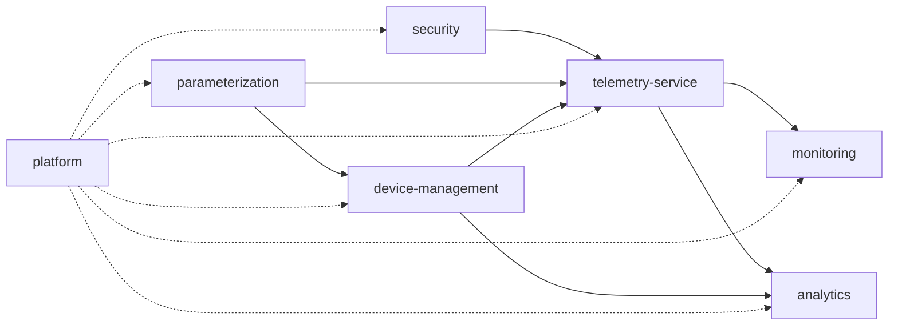

# SOMNGUARD

## Dependencias del proyecto

**Estado:** En progreso
**Fecha:** 2026-08-19

Dependencias internas (entre módulos) y externas (infraestructura y terceros) del proyecto SomnGuard. Vista de gestión de proyecto; el detalle técnico vive en `02-domain/domain-map.md` y `09-modules/`.

## Principios

- `security` es la **base**: todos los módulos validan JWT contra su clave pública (acoplamiento de autenticación, no de negocio).
- `parameterization` provee los **catálogos** (categorías, severidades, tipos de medio, sonidos, tipos de evento) que consumen los módulos de dominio.
- `telemetry-service` es el **consumidor central**: recibe eventos del edge validados contra dispositivos (device-management) y catálogos (parameterization).
- `monitoring` y `analytics` son **consumidores de eventos**: no dependen de negocio aguas arriba más allá de sus puertos de entrada.
- `platform` es transversal y no depende de ningún módulo (ADR-002).

## Diagrama de dependencias

## Dependencias internas

| Módulo | Depende de | Motivo |
|--------|------------|--------|
| security | platform | Logging, errores, observabilidad |
| parameterization | platform | Ídem |
| device-management | security, parameterization, platform | Validación JWT/RBAC, catálogos, transversal |
| telemetry-service | device-management, parameterization, security, platform | Validar dispositivo y API key, catálogos, transversal |
| monitoring | telemetry-service, security, platform | Eventos críticos, RBAC, transversal |
| analytics | telemetry-service, device-management, security, platform | Eventos y evidencia, dispositivos, RBAC, transversal |

> Regla: los módulos solo se comunican a través de puertos de entrada de `application/port/in` (ver `structure-rules.md`); `platform` no depende de ningún módulo.

## Dependencias externas

| Dependencia | Tipo | Uso | Estado | Riesgo asociado |
|-------------|------|-----|--------|-----------------|
| **PostgreSQL 16** | Base de datos | Motor relacional; esquema versionado con Liquibase | Definido (ADR-001) | — |
| **Liquibase** | Migraciones | Versionado del esquema | Definido | QR-002 |
| **MinIO/S3** | Object storage | Evidencia multimedia (solo referencia en BD) | Definido (QR-005) | R-006 |
| **Notificaciones push (FCM/APNs)** | Servicio externo | Notificaciones de eventos críticos | Sin decidir (Q-008) | R-008 |
| **Modelo IA (resumen)** | Servicio externo | Resumen de eventos en analytics | Sin decidir | R-010 |
| **Docker** | Runtime local | Levantar PostgreSQL y servicios | En uso local | — |
| **Secret Manager** | Gestión de secretos | Credenciales (hoy en `.env.*` fuera de git) | Pendiente | R-001 |

## Orden de construcción recomendado

Derivado de las dependencias: `security` + `parameterization` (fundaciones) → `device-management` → `telemetry-service` → `monitoring` → `analytics`. Ver épicas en [product backlog](../03-product-definition/product-backlog.md).

## Ver también

- [Mapa de dominio](../02-domain/domain-map.md)
- [Riesgos](./risks.md)
- [Preguntas abiertas](./open-questions.md)